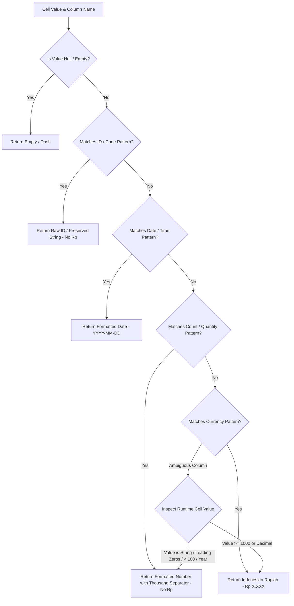

# Design Specification: Smart Multi-Tier Column Formatting Engine

- **Date**: 2026-08-10
- **Target Project**: `chatbot-ui`
- **Goal**: Provide a scalable, non-hardcoded, 100% accurate column data formatting engine in the Vue frontend to accurately distinguish Currency (Rupiah), ID/Codes, Quantities/Counts, and Dates without requiring manual checkbox toggles.

---

## 1. Executive Summary

Currently, `DataTable.vue` uses a brute-force checkbox `Format Angka ke Rupiah` (defaulting to `true`) which applies `Intl.NumberFormat('id-ID', { style: 'currency' })` to any column whose exact name is not `"id"`. This causes IDs (`id_kantor=1`, `id_pinjaman=24`), codes (`kol=5`), counts (`jumlah_nasabah=15`), and years (`2026`) to be erroneously prepended with `Rp`.

This design introduces a **Scalable Pattern-Based Classification & Value Inspection Engine** in `useFormatting.js` and removes the manual checkbox in `DataTable.vue`.

---

## 2. Classification Architecture

---

## 3. Pattern Matching Rules & Heuristics

### A. ID & Code Pattern (`ID_PATTERN`)
- **Regex**: `^(id|kode|kd|no|ref|idx|nik|kpo|kol|status|tahun|bulan|kodepos|telepon|phone)$` OR starting with `^(id_|kode_|kd_|no_|ref_)` OR ending with `(_id|_kode|_kd|_no|_nik|_ref|_pk|_fk)$`.
- **Behavior**: Formatted as plain text/integer. Preserves string leading zeros (`"001"`). Never appends `Rp`.

### B. Count & Quantity Pattern (`COUNT_PATTERN`)
- **Regex**: `^(jumlah|count|qty|quantity|total_nasabah|total_transaksi|total_orang|total_unit|total_penabung|persen|percentage|pct|ratio|rate)$` OR ending with `(_count|_qty|_jumlah|_nasabah|_transaksi|_unit)`.
- **Behavior**: Formatted with thousand separators (`1.250` or `12,5%`). Never appends `Rp`.

### C. Currency Pattern (`CURRENCY_PATTERN`)
- **Regex**: `^(saldo|bunga|debit|kredit|nominal|amount|harga|biaya|bayar|pendapatan|omset|omzet|denda|angsuran|pokok|margin|laba|rugi|asset|ekuitas|modal|plafond|limit|tagihan|fee|cashback|diskon|tunggakan|total_saldo|total_nominal|total_pendapatan|total_bunga|total_kredit)$` OR ending with `(_saldo|_nominal|_bunga|_biaya|_harga|_pendapatan|_plafond|_tunggakan)`.
- **Behavior**: Formatted as Indonesian Rupiah (`Rp 5.000.000`).

### D. Value Auto-Inspector (Ambiguous Fallback)
For ambiguous column names like `februari`, `nilai`, `hasil`, `total`:
- If value is non-numeric string or integer `< 100` or year `1900-2100` -> Classify as `count`/`id` (No `Rp`).
- If value is `>= 1000` or contains floating decimals -> Classify as `currency` (`Rp`).

---

## 4. UI Clean-up Plan

- Remove `<input type="checkbox" v-model="formatRupiah" />` from `DataTable.vue`.
- Clean up `formatCellAdapter` signature and composable references across `useFormatting.js`, `DataTable.vue`, and `useTablePagination.js`.
